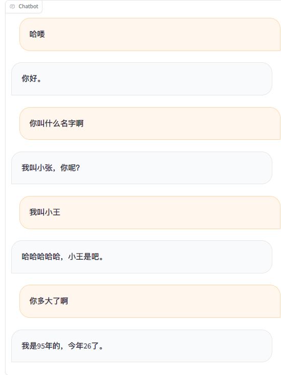
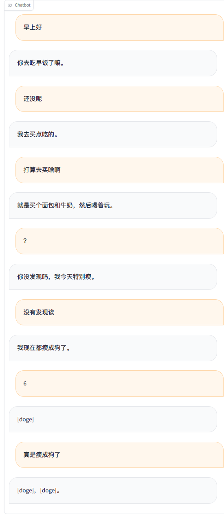
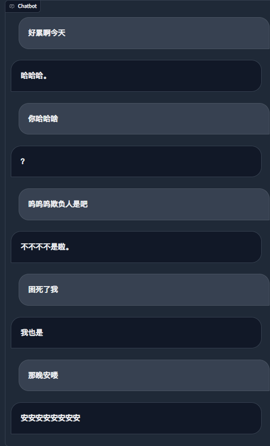

## 核心功能✨
- 💬 使用微信聊天记录微调LLM
- 🎙️ 使用微信语音消息➕0.5B大模型实现高质量声音克隆 👉[WeClone-audio](https://github.com/xming521/WeClone/tree/master/WeClone-audio)
- 🔗 绑定到微信机器人，实现自己的数字分身

## 特性与说明📋

> [!TIP]
> 新特性：[WeClone-audio](https://github.com/xming521/WeClone/tree/master/WeClone-audio) 模块，支持对微信语音进行克隆。

> [!NOTE]
> 聊天机器人后续使用 AstrBot 实现

> [!IMPORTANT]
> 微调LLM最终效果很大程度取决于聊天数据的数量和质量

### 硬件要求

目前项目默认使用chatglm3-6b模型，LoRA方法对sft阶段微调，大约需要16GB显存。也可以使用[LLaMA Factory](https://github.com/hiyouga/LLaMA-Factory/blob/main/README_zh.md#%E6%A8%A1%E5%9E%8B)支持的其他模型和方法，占用显存更少，需要自行修改模板的system提示词等相关配置。

需要显存的估算值：
| 方法                             | 精度 |   7B  |  14B  |  30B  |   70B  |   `x`B  |
| ------------------------------- | ---- | ----- | ----- | ----- | ------ | ------- |
| Full (`bf16` or `fp16`)         |  32  | 120GB | 240GB | 600GB | 1200GB | `18x`GB |
| Full (`pure_bf16`)              |  16  |  60GB | 120GB | 300GB |  600GB |  `8x`GB |
| Freeze/LoRA/GaLore/APOLLO/BAdam |  16  |  16GB |  32GB |  64GB |  160GB |  `2x`GB |
| QLoRA                           |   8  |  10GB |  20GB |  40GB |   80GB |   `x`GB |
| QLoRA                           |   4  |   6GB |  12GB |  24GB |   48GB | `x/2`GB |
| QLoRA                           |   2  |   4GB |   8GB |  16GB |   24GB | `x/4`GB |


### 环境搭建
建议使用 [uv](https://docs.astral.sh/uv/)，这是一个非常快速的 Python 环境管理器。安装uv后，您可以使用以下命令创建一个新的Python环境并安装依赖项，注意这不包含xcodec（音频克隆）功能的依赖：
```bash
git clone https://github.com/xming521/WeClone.git
cd WeClone
uv venv .venv --python=3.9
source .venv/bin/activate
uv pip install --group main -e . 
```

> [!NOTE]
> 训练以及推理相关配置统一在文件[settings.json](settings.json)


### 数据准备

请使用[PyWxDump](https://github.com/xaoyaoo/PyWxDump)提取微信聊天记录。下载软件并解密数据库后，点击聊天备份，导出类型为CSV，可以导出多个联系人或群聊，然后将导出的位于`wxdump_tmp/export` 的 `csv` 文件夹放在`./data`目录即可，也就是不同人聊天记录的文件夹一起放在 `./data/csv`。 示例数据位于[data/example_chat.csv](data/example_chat.csv)。

### 数据预处理

项目默认去除了数据中的手机号、身份证号、邮箱、网址。还提供了一个禁用词词库[blocked_words](make_dataset/blocked_words.json)，可以自行添加需要过滤的词句（会默认去掉包括禁用词的整句）。
执行 `./make_dataset/csv_to_json.py` 脚本对数据进行处理。

在同一人连续回答多句的情况下，有三种处理方式：
| 文件 | 处理方式 |
| --- | --- |
| csv_to_json.py | 用逗号连接 |
| csv_to_json-单句回答.py(已废弃) | 只选择最长的回答作为最终数据 |
| csv_to_json-单句多轮.py | 放在了提示词的'history'中 |

### 模型下载

首选在Hugging Face下载[ChatGLM3](https://huggingface.co/THUDM/chatglm3-6b) 模型。如果您在 Hugging Face 模型的下载中遇到了问题，可以通过下述方法使用魔搭社区，后续训练推理都需要先执行`export USE_MODELSCOPE_HUB=1`来使用魔搭社区的模型。  
由于模型较大，下载过程比较漫长请耐心等待。

```bash
export USE_MODELSCOPE_HUB=1 # Windows 使用 `set USE_MODELSCOPE_HUB=1`
git lfs install
git clone https://www.modelscope.cn/ZhipuAI/chatglm3-6b.git
```
魔搭社区的`modeling_chatglm.py`文件需要更换为Hugging Face的

### 配置参数并微调模型

- (可选)修改 [settings.json](settings.json)选择本地下载好的其他模型。  

- 修改`per_device_train_batch_size`以及`gradient_accumulation_steps`来调整显存占用。  
- 可以根据自己数据集的数量和质量修改`num_train_epochs`、`lora_rank`、`lora_dropout`等参数。

#### 单卡训练

运行 `src/train_sft.py` 进行sft阶段微调，本人loss只降到了3.5左右，降低过多可能会过拟合，我使用了大概2万条整合后的有效数据。

```bash
python src/train_sft.py
```

#### 多卡训练

```bash
pip install deepspeed
deepspeed --num_gpus=使用显卡数量 src/train_sft.py
```


### 使用浏览器demo简单推理

```bash
python ./src/web_demo.py 
```

### 使用接口进行推理

```bash
python ./src/api_service.py
```

### 使用常见聊天问题测试

```bash
python ./src/api_service.py
python ./src/test_model.py
```

### 部署微信聊天机器人

> [!IMPORTANT]
>
> 微信有封号风险，建议使用小号，并且必须绑定银行卡才能使用

```bash
python ./src/api_service.py # 先启动api服务
python ./src/wechat_bot/main.py 
```

默认在终端显示二维码，扫码登录即可。可以私聊或者在群聊中@机器人使用。

### 截图






### 使用RAG补充知识

Todo

### 多模态

Todo


# 免责声明
> [!CAUTION]
> 请勿用于非法用途，否则后果自负。

### 1. 使用目的

* 本项目仅供学习交流使用，**请勿用于非法用途**，**请勿用于非法用途**，**请勿用于非法用途**，否则后果自负。
* 用户理解并同意，任何违反法律法规、侵犯他人合法权益的行为，均与本项目及其开发者无关，后果由用户自行承担。

### 2. 使用期限

* 您应该在下载保存使用本项目的24小时内，删除本项目的源代码和程序；超出此期限的任何使用行为，一概与本项目及其开发者无关。

### 3. 操作规范

* 本项目仅允许在授权情况下使用数据训练，严禁用于非法目的，否则自行承担所有相关责任；用户如因违反此规定而引发的任何法律责任，将由用户自行承担，与本项目及其开发者无关。
* 严禁用于窃取他人隐私，严禁用于窃取他人隐私，严禁用于窃取他人隐私，否则自行承担所有相关责任。

### 4. 免责声明接受

* 下载、保存、进一步浏览源代码或者下载安装、编译使用本程序，表示你同意本警告，并承诺遵守它;

### 5. 禁止用于非法测试或渗透

* 禁止利用本项目的相关技术从事非法测试或渗透，禁止利用本项目的相关代码或相关技术从事任何非法工作，如因此产生的一切不良后果与本项目及其开发者无关。
* 任何因此产生的不良后果，包括但不限于数据泄露、系统瘫痪、侵犯隐私等，均与本项目及其开发者无关，责任由用户自行承担。

### 6. 免责声明修改

* 本免责声明可能根据项目运行情况和法律法规的变化进行修改和调整。用户应定期查阅本页面以获取最新版本的免责声明，使用本项目时应遵守最新版本的免责声明。

### 7. 其他

* 除本免责声明规定外，用户在使用本项目过程中应遵守相关的法律法规和道德规范。对于因用户违反相关规定而引发的任何纠纷或损失，本项目及其开发者不承担任何责任。

* 请用户慎重阅读并理解本免责声明的所有内容，确保在使用本项目时严格遵守相关规定。


请用户慎重阅读并理解本免责声明的所有内容，确保在使用本项目时严格遵守相关规定。
