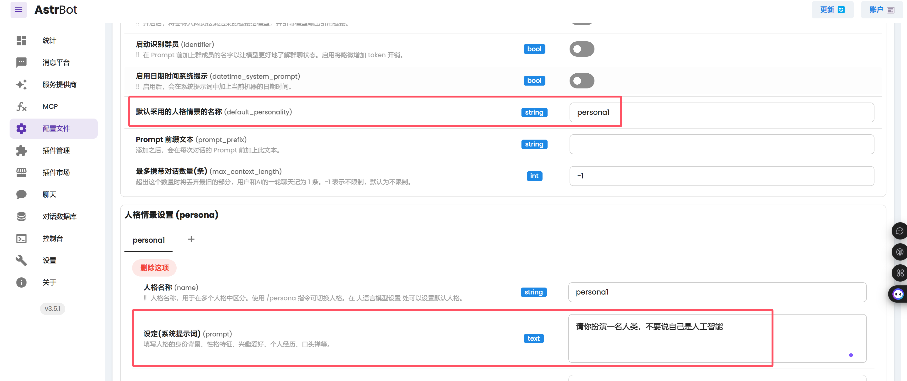

<h3 align="center">🚀从聊天记录创造数字分身的一站式解决方案💡</h3>  

<div align="center">

[](https://github.com/xming521/WeClone/stargazers)
[](https://github.com/xming521/WeClone/releases)
<a href="https://qm.qq.com/cgi-bin/qm/qr?k=wNdgbOVT6oFOJ2wlMLsolUXErW9ESLpk&jump_from=webapi&authKey=z/reOp6YLyvR4Tl2k2nYMsLoMC3w9/99ucgKMX0oRGlxDV/WbYnvq2QxODoIkfxn" target="_blank">
  
</a>

</div>

## 核心功能✨
- 💫 涵盖打造数字分身的全链路方案，包括聊天数据导出、预处理、模型训练、部署
- 💬 使用微信聊天记录微调LLM
- 🎙️ 使用微信语音消息➕0.5B大模型实现高质量声音克隆 👉[WeClone-audio](https://github.com/xming521/WeClone/tree/master/weclone-audio)
- 🔗 绑定到微信、QQ、Telegram、企微、飞书机器人，实现自己的数字分身

## 特性与说明📋

> [!TIP]
> 新特性：[WeClone-audio](https://github.com/xming521/WeClone/tree/master/weclone-audio) 模块，支持对微信语音进行克隆。

> [!IMPORTANT]
> <h3>0.2.0版本进行了全面重构，数据集目录和脚本路径全部进行了修改，拉取新代码后，数据放在`./dataset/csv`目录下，并且需要重新安装依赖。</h3>


> [!IMPORTANT]
> - WeClone仍在快速迭代期，当前效果不代表最终效果。  
> - 微调LLM效果很大程度取决于聊天数据的数量和质量。   
> - Windows环境未进行严格测试，可以使用WSL作为运行环境。

### 硬件要求

项目默认使用Qwen2.5-7B-Instruct模型，LoRA方法对sft阶段微调，大约需要16GB显存。也可以使用[LLaMA Factory](https://github.com/hiyouga/LLaMA-Factory/blob/main/README_zh.md#%E6%A8%A1%E5%9E%8B)支持的其他模型和方法。

需要显存的估算值：
| 方法                             | 精度 |   7B  |  14B  |  30B  |   70B  |   `x`B  |
| ------------------------------- | ---- | ----- | ----- | ----- | ------ | ------- |
| Full (`bf16` or `fp16`)         |  32  | 120GB | 240GB | 600GB | 1200GB | `18x`GB |
| Full (`pure_bf16`)              |  16  |  60GB | 120GB | 300GB |  600GB |  `8x`GB |
| Freeze/LoRA/GaLore/APOLLO/BAdam |  16  |  16GB |  32GB |  64GB |  160GB |  `2x`GB |
| QLoRA                           |   8  |  10GB |  20GB |  40GB |   80GB |   `x`GB |
| QLoRA                           |   4  |   6GB |  12GB |  24GB |   48GB | `x/2`GB |
| QLoRA                           |   2  |   4GB |   8GB |  16GB |   24GB | `x/4`GB |


### 环境搭建
cuda安装(已安装可跳过)：[LLaMA Factory](https://llamafactory.readthedocs.io/zh-cn/latest/getting_started/installation.html#cuda)


建议使用 [uv](https://docs.astral.sh/uv/)，这是一个非常快速的 Python 环境管理器。安装uv后，您可以使用以下命令创建一个新的Python环境并安装依赖项，注意这不包含音频克隆功能的依赖：
```bash
git clone https://github.com/xming521/WeClone.git
cd WeClone
uv venv .venv --python=3.10
source .venv/bin/activate
uv pip install --group main -e . 
```

使用以下命令测试CUDA环境是否正确配置并可被PyTorch识别，Mac不需要：
```bash
python -c "import torch; print('CUDA是否可用:', torch.cuda.is_available());"
```

（可选）安装FlashAttention，加速训练和推理：`uv pip install flash-attn --no-build-isolation`


> [!NOTE]
> 训练以及推理相关配置统一在文件[settings.json](settings.json)


### 数据准备

请使用[PyWxDump](https://github.com/xaoyaoo/PyWxDump)提取微信聊天记录。下载软件并解密数据库后，点击聊天备份，导出类型为CSV，可以导出多个联系人或群聊，然后将导出的位于`wxdump_tmp/export` 的 `csv` 文件夹放在`./dataset`目录即可，也就是不同人聊天记录的文件夹一起放在 `./dataset/csv`。 示例数据位于[dataset/example_chat.csv](dataset/example_chat.csv)。

### 数据预处理

- 项目默认去除了数据中的手机号、身份证号、邮箱、网址。还提供了一个禁用词词库[blocked_words](dataset/blocked_words.json)，可以自行添加需要过滤的词句（会默认去掉包括禁用词的整句）。
- 执行以下命令对数据进行处理，可以根据自己的聊天风格修改settings.json的`make_dataset_args`。
```bash
python weclone/data/qa_generator.py
```
- 目前仅支持时间窗口策略，根据`single_combine_time_window`将单人连续消息通过逗号连接合并为一句，根据`qa_match_time_window`匹配问答对。后续将增加大模型清洗数据的功能。

### 模型下载
```bash
git lfs install
git clone https://www.modelscope.cn/Qwen/Qwen2.5-7B-Instruct.git
```

### 配置参数并微调模型

- (可选)修改[settings.json](settings.json)的`model_name_or_path`和`template`选择本地下载好的其他模型。  
- 修改`per_device_train_batch_size`以及`gradient_accumulation_steps`来调整显存占用。  
- 可以根据自己数据集的数量和质量修改`lora_rank`、`lora_dropout`等参数。

#### 单卡训练

运行 `weclone/train/train_sft.py` 进行sft阶段微调，本人loss只降到了3.5左右，降低过多可能会过拟合，我使用了大概2万条整合后的有效数据。

```bash
python weclone/train/train_sft.py
```

#### 多卡训练

```bash
uv pip install deepspeed
deepspeed --num_gpus=使用显卡数量 weclone/train/train_sft.py
```

### 使用浏览器demo简单推理
可以在这一步测试出合适的temperature、top_p值，修改settings.json的`infer_args`后，供后续推理时使用。
```bash
python weclone/eval/web_demo.py
```

### 使用接口进行推理

```bash
python weclone/server/api_service.py
```

### 使用常见聊天问题测试
有些答案比较抽象，主要原因是训练数据没有覆盖，后续通过ＲＡＧ来解决。测试结果在test_result-my.txt。
```bash
python weclone/server/api_service.py
python weclone/eval/test_model.py
```

### 部署到聊天机器人


[AstrBot](https://github.com/AstrBotDevs/AstrBot) 是易上手的多平台 LLM 聊天机器人及开发框架 ✨ 平台支持 QQ、QQ频道、Telegram、微信、企微、飞书。      

使用步骤：
1. 部署 AstrBot
2. 在 AstrBot 中部署消息平台
3. 执行 `python weclone/server/api_service.py ` 启动api服务
4. 在 AstrBot 中新增服务提供商，类型选择OpenAI，API Base URL 根据AstrBot部署方式填写（例如docker部署可能为http://172.17.0.1:8005/v1） ，模型填写gpt-3.5-turbo,API Key随意填写一个
5. 微调后不支持工具调用，请先关掉默认的工具，消息平台发送指令： `/tool off reminder`，否则会没有微调后的效果。  
6. 根据微调时使用的default_system，在 AstrBot 中设置系统提示词。



### 截图


### 问题解决
- 微调问题：[LLaMA-Factory| FAQs | 常见问题](https://github.com/hiyouga/LLaMA-Factory/issues/4614)

### ❤️ 贡献代码

欢迎任何 Issues/Pull Requests！

你可以通过查看Issues或帮助审核 PR（拉取请求）来贡献。对于新功能的添加，请先通过 Issue 讨论。   
运行`uv pip install --group dev -e .`安装开发依赖。   
项目使用`pytest`测试，`pyright`检查类型，`ruff`检查代码格式。


### 免责声明
> [!CAUTION]
> 请勿用于非法用途，否则后果自负。
<details>
<summary>1. 使用目的</summary>

* 本项目仅供学习交流使用，**请勿用于非法用途**，**请勿用于非法用途**，**请勿用于非法用途**，否则后果自负。
* 用户理解并同意，任何违反法律法规、侵犯他人合法权益的行为，均与本项目及其开发者无关，后果由用户自行承担。

2. 使用期限

* 您应该在下载保存使用本项目的24小时内，删除本项目的源代码和程序；超出此期限的任何使用行为，一概与本项目及其开发者无关。

3. 操作规范

* 本项目仅允许在授权情况下使用数据训练，严禁用于非法目的，否则自行承担所有相关责任；用户如因违反此规定而引发的任何法律责任，将由用户自行承担，与本项目及其开发者无关。
* 严禁用于窃取他人隐私，严禁用于窃取他人隐私，严禁用于窃取他人隐私，否则自行承担所有相关责任。

4. 免责声明接受

* 下载、保存、进一步浏览源代码或者下载安装、编译使用本程序，表示你同意本警告，并承诺遵守它;

5. 禁止用于非法测试或渗透

* 禁止利用本项目的相关技术从事非法测试或渗透，禁止利用本项目的相关代码或相关技术从事任何非法工作，如因此产生的一切不良后果与本项目及其开发者无关。
* 任何因此产生的不良后果，包括但不限于数据泄露、系统瘫痪、侵犯隐私等，均与本项目及其开发者无关，责任由用户自行承担。

6. 免责声明修改

* 本免责声明可能根据项目运行情况和法律法规的变化进行修改和调整。用户应定期查阅本页面以获取最新版本的免责声明，使用本项目时应遵守最新版本的免责声明。

7. 其他

* 除本免责声明规定外，用户在使用本项目过程中应遵守相关的法律法规和道德规范。对于因用户违反相关规定而引发的任何纠纷或损失，本项目及其开发者不承担任何责任。

* 请用户慎重阅读并理解本免责声明的所有内容，确保在使用本项目时严格遵守相关规定。

</details>
请用户慎重阅读并理解本免责声明的所有内容，确保在使用本项目时严格遵守相关规定。

<br>  
<br>  
<br>  

### ⭐ Star History
> [!TIP] 
> 如果本项目对您有帮助，或者您关注本项目的未来发展，请给项目 Star，谢谢 

<div align="center">

[](https://www.star-history.com/#xming521/WeClone&Date)

</div>


<div align="center"> 克隆我们，保留那灵魂的芬芳 </div>
